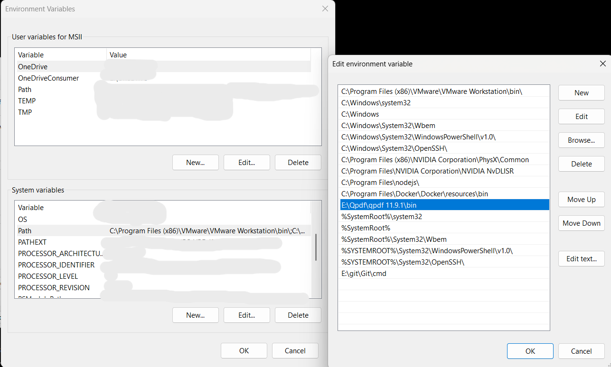

# check-PDF Windows

#step1 install QPDF on Windows:
https://sourceforge.net/projects/qpdf/
 
#step2. Extract the QPDF file
Once the download is complete, extract the .zip file to the folder of your choice, for example  
 C:\qpdf\

#step3. Set PATH to run QPDF from command line
- Right click on This PC or My Computer on desktop and select Properties
- Select Advanced system settings
- Click on Environment Variables
- In System Variables section, find Path variable and click Edit
- Add the path of folder containing QPDF

#step4  Test QPDF installation
Open a new Command Prompt Type the following command to check if QPDF is installed successfully.

      qpdf --version

#step5 create Script file : CheckPDF.ps1

#step6 Script file details

        param (
            [string]$folderPath = "E:\pdfs",  
            [string]$logFileName = "PDF_Check_Report.txt"  
         )
   
         logFilePath = Join-Path -Path $folderPath -ChildPath $logFileName
   
   
         if (Test-Path $logFilePath) {
             Remove-Item $logFilePath
         }
     
     
         $damagedFiles = @()
     
     
         Get-ChildItem -Path $folderPath -Filter *.pdf -Recurse | ForEach-Object {
           $file = $_.FullName
           $result = qpdf --check $file 2>&1
         
           if ($result -like "*file is damaged*") {
               $output = "$file is damaged"
               $damagedFiles += $output  
           }
         }
     
     
         if ($damagedFiles.Count -gt 0) {
             $damagedFiles | Out-File -Append -FilePath $logFilePath
             Write-Output "Damaged files found:"
             $damagedFiles
        } else {
             Write-Output "No damaged files found."
        }
     
     
         Write-Output "PDF check completed. See results in $logFilePath"

#step7 Open PowerShell and go to the folder
        
        Set-Location -Path "path"

#step8 Run the script with this command
         
         .\CheckPDF.ps1 -folderPath "path" -logFileName "MyReport.txt"

